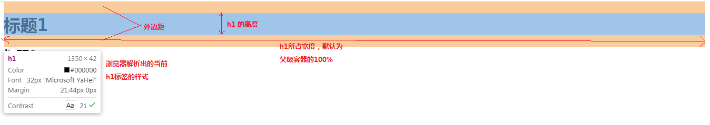

# HTML基本结构
HTML和XML语法相同，必须有一个根节点，标签由双标签和单标签组成
   - 双标签的语法    
    `<开始标签></结束标签>`
   - 单标签
    `<标签 />`

html网页由一个html标签组成；
```html
    <html></html>
```
html标签中由`head`标签和`body`标签组成。
`head`标签中通常编写的网页的`title`标签，代表网页的标题。也可以在`head`标签内设置响应式布局、引入css文件、引入js文件、设置SEO\SEM等等；
`body`标签中的内容为显示在网页中的内容；是我们开发的时候主要关注的部分；
```html
    <html>
        <head>
            <title>网页的标题</title>
        </head>
        <body>
            网页的内容
        </body>
    </html>
```
---- 
- 标题标签
  
    标题标签主要用在网页中的不同的逻辑区域部分，用作标题；在网页中标题标签总共只有<font color="red">***6个***</font>，六个标题标签的区别在于大小不同；每个标题标签的上下都和其他标签有明显的间距（外边距；`margin`）；标题标签字体加粗显示。
   + 标题1
    ```html
        <h1>标题内容</h1>
    ```
    
   + 标题2
    ```html
        <h2>标题内容</h2>
    ```
   + 标题3
    ```html
        <h3>标题内容</h3>
    ```
   + 标题4
    ```html
        <h4>标题内容</h4>
    ```
   + 标题5
    ```html
        <h5>标题内容</h5>
    ```
   + 标题6
    ```html
        <h6>标题内容</h6>
    ```
- 段落标签
  
  段落标签用于作为某个区域的段，比如一篇文章，一段内容就可以通过一对段落标签表示；
  段落标签默认上下同样存在外边距；
  ```html
    <p>
        段落标签的内容
    </p>
  ```
- 换行标签

    `<br />`
- 水平线标签

    `<hr />`

- 字体样式标签

    字体样式标签包含对字体加粗以及字体倾斜。这两种字体样式以后均通过css可以非常方便的实现。
   + 字体加粗

        `<strong></strong>`
   + 字体倾斜

        `<em></em>`

- 特殊符号
  
  由于某部分的符号具有特别的含义，因此在网页中直接写符号不能够被浏览器识别。w3c就定义了一些具有和其相同作用的特殊符号。特殊符号都是已`&`符号开头,已`;`分号结尾；
  | 特殊符号  | 字符实体 |                      示例                       |
  | :-------: | :------: | :---------------------------------------------: |
  |   空格    |  &nbsp;  |             <a>百&nbsp;&nbsp;度</a>             |
  |   大于>   |   &gt;   |         如果时间&gt;晚上6点，就坐车回家         |
  |   小于<   |   &lt;   |        如果时间&lt;早上7点，就走路去上学        |
  |   引号"   |  &quot;  | W3C规范中，HTML的属性值必须用成对的&quot;引起来&quot; |
  | 版权符号© |  &copy;  |            &copy; 2003-2013合肥奔驰             |
- 图片标签
    图片标签用于在网页中显示指定格式的图片，常见格式有jpg,gif,png.
    图片标签是一种行级块元素，多个图片标签默认会在浏览器中横向排列显示。
    ```html
        
    ```
- 超链接标签
  
  网页中，通过超链接使页面和其他页面具有的交互性。通过超链接能够实现从当前页面跳转到其他页面的操作。是网页开发中必不可少的一个标签。a标签可以实现超链接，也可以实现锚链接，也可以实现功能链接，现在用的非常少，功能链接的作用为打开本地系统中安全的邮件app（outlook).
   - 超链接

    ```html
        <a href="url地址" target="打开方式，_self|_blank" title="标题">链接地址或图片</a>
        <!--
            target是a标签的默认打开方式，默认为_self.在当前页面中打开新的页面。
            _blank在新的网页选项卡中打开页面。
        -->
    ```
   - 锚链接

    在网页中的某些位置做标记，然后通过锚链接快速跳转到该标记。要实现锚链接，必须保证网页具有足够的高度。
    ```html
        <!--1.在网页中的某个位置做上标记-->
        <a name="top"></a>

        <!--2.在网页的某个地方通过超链接指向target-->
        <a href="#top">返回顶部</>
    ```
   - 功能链接

    ```html
        <a href="mailto:123456@qq.com">给我发邮件</a>
    ```

